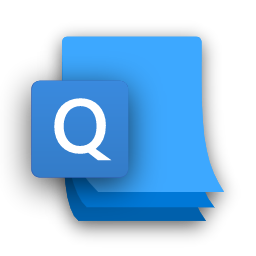

  
  <h1 align="center">Quick-Pad</h1>

* Fluent design with dark and light theme support.
* Launch from the run dialog box by typing "Quickpad".
* Compact Overlay mode will make the app stay on top of other apps or windows.
* Focus mode hides all distractions.
* Auto save ensures your works is safe.

## Downloads:

Please head over to [Github Releases](https://github.com/UWPCommunity/Quick-Pad/releases) section to download the latest release or get the latest version of Quick Pad in the [Microsoft Store](https://www.microsoft.com/store/productId/9PDLWQHTLSV3).

## Special Thanks:

* Code Contributors: [Toon Werawat](https://github.com/ray199), [Leisvan](https://github.com/Leisvan), [The Sharp Ninja](https://github.com/sharpninja), 
* Localization Contributors: 
    * [fr-CA][French] [themoiFR](https://github.com/themoiFR), [PhilLB1239](https://github.com/PhilLB1239)
    * [es][Spanish] [Leisvan](https://github.com/Leisvan)
    * [fr-FR][French] [themoiFR](https://github.com/themoiFR), [François-Joseph du Fou](https://github.com/FJduFou)
